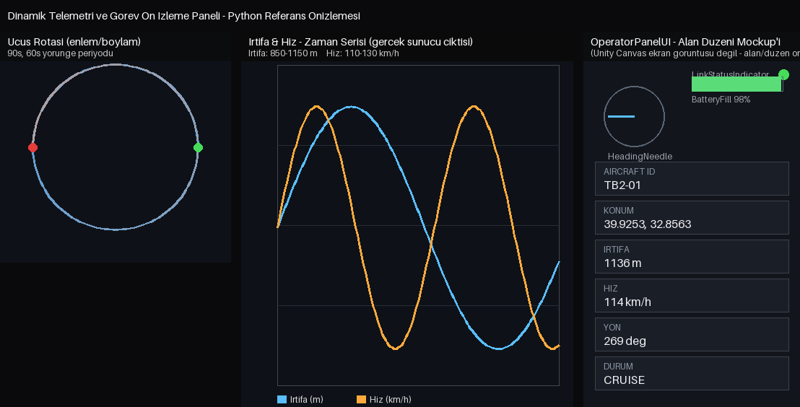

# Dinamik Telemetri ve Görev Ön İzleme Paneli

> **Baykar Yüksek İrtifa Yetenek Programı** başvurusu için hazırlanan 3 parçalı prototip serisinin 2. parçası:
> 🗺️ [Waypoint & Rota Planlama](https://github.com/kayabetul744/baykar-mission-planner-prototype) · 📡 **Telemetri & Operatör Paneli** (bu repo) · 🛬 [Kalkış/İniş Pisti Uygunluk Analizi](https://github.com/kayabetul744/baykar-runway-siting-prototype)


*Soldan sağa: mock sunucunun gerçekten ürettiği uçuş rotası, aynı sunucudan alınan gerçek irtifa/hız zaman
serisi, ve `OperatorPanelUI.cs`'deki alan/düzen mantığını yansıtan bir mockup (Unity Canvas ekran görüntüsü
değildir — bu ortamda Unity Editor mevcut olmadığından, alan yerleşimini gösteren elle çizilmiş bir
diyagram kullandım). İlk iki panel gerçek, çalıştırılmış `telemetry_server.py` çıktısına dayanır.*

Bu prototip, **Baykar Yüksek İrtifa Yetenek Programı** ilanındaki *"Sanal Etkileşimli Misyon Asistanı"*
konseptinin operatör/telemetri tarafına yönelik hazırlanmış, geliştirme aşamasındaki bir AR-GE çalışmasıdır.
Amaç; dış bir sunucudan (gerçek hayatta bir Yer Kontrol İstasyonu / GCS) gelen anlık uçuş verisinin
`UnityWebRequest` ile asenkron çekilmesi, JSON olarak parse edilmesi, bir **operatör paneli** (Canvas UI)
üzerinde düşük gecikmeyle görselleştirilmesi ve görevin **hava aracı perspektifinden** ön izlenmesidir.

Gerçek bir GCS sunucusuna erişim olmadığından, depo içinde standart kütüphane dışında bağımlılığı
olmayan bir **mock telemetri sunucusu** (`mock-server/telemetry_server.py`) bulunur; bu sunucu dairesel
bir rotada uçan bir İHA'yı simüle eder. Gerçek bir dağıtımda Unity Inspector'daki `endpointUrl` alanına
gerçek GCS adresi yazılması yeterlidir — istemci kodu değişmez.

## İlan Kriterleriyle Eşleşme

| İlan Kriteri | Bu Prototipte Karşılığı |
|---|---|
| Dış sunucudan anlık uçuş verisinin asenkron çekilmesi | `TelemetryClient.cs` — `UnityWebRequest` + Coroutine tabanlı periyodik polling, zaman aşımı ve hata yönetimi |
| JSON verisinin parse edilmesi | `TelemetryData.cs` (JsonUtility uyumlu) + `JsonUtility.FromJson` |
| Canvas UI üzerinde operatör paneli, low-latency görselleştirme | `OperatorPanelUI.cs` — event tabanlı güncelleme (her karede değil, yalnızca yeni paket geldiğinde UI yenilenir) |
| Görevin hava aracı perspektifinden ön izlenmesi | `AircraftPositionMapper.cs` + `ReferenceGroundBuilder.cs` — telemetriden gelen konum/yön ile 3B sahnede hareket eden uçak + ona bağlı önizleme kamerası |

## Klasör Yapısı

```
mock-server/
  telemetry_server.py     -> standart kutuphane ile yazilmis, "dis sunucu" yerine gecen mock GCS sunucusu
Assets/
  Scripts/TelemetryPanel/
    TelemetryData.cs          -> JSON telemetri semasi (JsonUtility uyumlu)
    TelemetryClient.cs         -> UnityWebRequest ile asenkron polling + JSON parse + event yayini
    OperatorPanelUI.cs         -> Canvas UI operator paneli (metin alanlari, pusula ibresi, batarya, baglanti durumu)
    AircraftPositionMapper.cs  -> enlem/boylam/irtifa/yon -> yerel 3B konum/rotasyon donusumu
    ReferenceGroundBuilder.cs  -> onizleme sahnesi icin basit zemin + gorsel referans noktalari
  Scenes/                     -> sahne dosyaniz burada saklanacak (asagidaki kuruluma bakin)
```

## Kurulum

### 1. Mock telemetri sunucusunu çalıştırın

```bash
cd mock-server
python3 telemetry_server.py        # varsayilan port 8080
```

Sunucu `http://localhost:8080/telemetry` adresinde JSON telemetri paketleri üretmeye başlar
(`aircraftId`, `latitude`, `longitude`, `altitudeMeters`, `speedKmh`, `headingDegrees`,
`batteryPercent`, `status`, `linkQuality`).

### 2. Unity projesini açın

**Unity Hub** üzerinden `Add` ile bu klasörü proje olarak açın. Önerilen sürüm **2022.3 LTS**'tir;
proje built-in render pipeline kullanır, ek paket (URP/HDRP/TextMeshPro) gerekmez. İlk açılışta Unity,
eksik `ProjectSettings` dosyalarını otomatik varsayılanlarla tamamlar — bu normaldir.

### 3. Sahneyi kurun (yaklaşık 5 dakika)

Depoya hazır bir `.unity` sahnesi dahil edilmedi; editördeki `Add Component` akışının bağımlılıkları
(ör. Canvas/EventSystem) doğru şekilde oluşturduğundan emin olmak için sahneyi editör üzerinden kurun:

1. `File > New Scene > Basic (Built-in)` ile yeni sahne açın, `Assets/Scenes/TelemetryPanel.unity`
   olarak kaydedin.
2. Hierarchy'de sağ tık > `Create Empty`, adını **TelemetryClient** yapın, `Add Component >
   TelemetryClient` ekleyin. `Endpoint Url` alanının `http://localhost:8080/telemetry` olduğunu
   doğrulayın.
3. Hierarchy'de sağ tık > `UI > Canvas` ile bir Canvas oluşturun (EventSystem otomatik eklenir).
   Canvas altına aşağıdaki UI elemanlarını ekleyin (`UI > Text`, `UI > Image`, vb.):
   - `AircraftIdText`, `PositionText`, `AltitudeText`, `SpeedText`, `HeadingText`, `StatusText`,
     `LastUpdateText` (Text bileşenleri)
   - `HeadingNeedle` (bir Image, pusula ibresi gibi davranması için)
   - `LinkStatusIndicator` (küçük bir Image, bağlantı durumunu renkle gösterir)
   - `BatteryFill` (Image Type = Filled olan bir Image)
4. Canvas altına boş bir GameObject ekleyin, adını **OperatorPanel** yapın, `Add Component >
   OperatorPanelUI` ekleyin. Inspector'da `Client` alanına `TelemetryClient` nesnesini, diğer tüm
   alanlara adım 3'te oluşturduğunuz UI elemanlarını sürükleyin.
5. Hierarchy'de sağ tık > `Create Empty`, adını **Aircraft** yapın; içine bir `Cube` (ölçek ör.
   `1, 1, 3`) ekleyerek basit bir uçak gövdesi oluşturun. **Aircraft** altına bir `Camera` ekleyin,
   yerel konumunu `(0, 1, -3)` yapın (hava aracı perspektifi için arkadan/yukarıdan bakan kamera).
6. Hierarchy'de sağ tık > `Create Empty`, adını **PositionMapper** yapın, `Add Component >
   AircraftPositionMapper` ekleyin. `Client` alanına `TelemetryClient`'ı, `Aircraft Transform`
   alanına **Aircraft** nesnesini sürükleyin.
7. Hierarchy'de sağ tık > `Create Empty`, adını **Ground** yapın, `Add Component >
   ReferenceGroundBuilder` ekleyin.
8. `Play`'e basın — operatör panelindeki değerlerin ve pusula ibresinin canlı güncellendiğini,
   **Aircraft** kamerasını Scene/Game görünümünde seçtiğinizde ise uçağın referans zemin üzerinde
   dairesel rotada hareket ettiğini göreceksiniz.

## Tasarım Notları

- `AircraftPositionMapper`, enlem/boylam farkını basit bir düzlemsel ölçekleme ile sahne birimine
  çevirir (gerçek bir jeodezik izdüşüm değildir) — prototip kapsamında kasıtlı bir sadeleştirmedir.
- `TelemetryClient`, bağlantı hatasında (`OnConnectionError`) veya zaman aşımında operatör panelinin
  bağlantı durumu göstergesini kırmızıya çevirir; böylece link kaybı senaryosu da görselleştirilebilir.
- Poll aralığı (`pollIntervalSeconds`) ve zaman aşımı (`requestTimeoutSeconds`) Inspector'dan
  ayarlanabilir; gerçek bir GCS entegrasyonunda ağ gecikmesine göre kalibre edilmesi gerekir.

## Yol Haritası

- Mock sunucunun yerine gerçek bir GCS/MAVLink köprüsünden gelen veri.
- WebSocket tabanlı push modeline geçiş (polling yerine), daha da düşük gecikme için.
- Operatör panelinde geçmiş telemetri grafiği (irtifa/hız zaman serisi).
